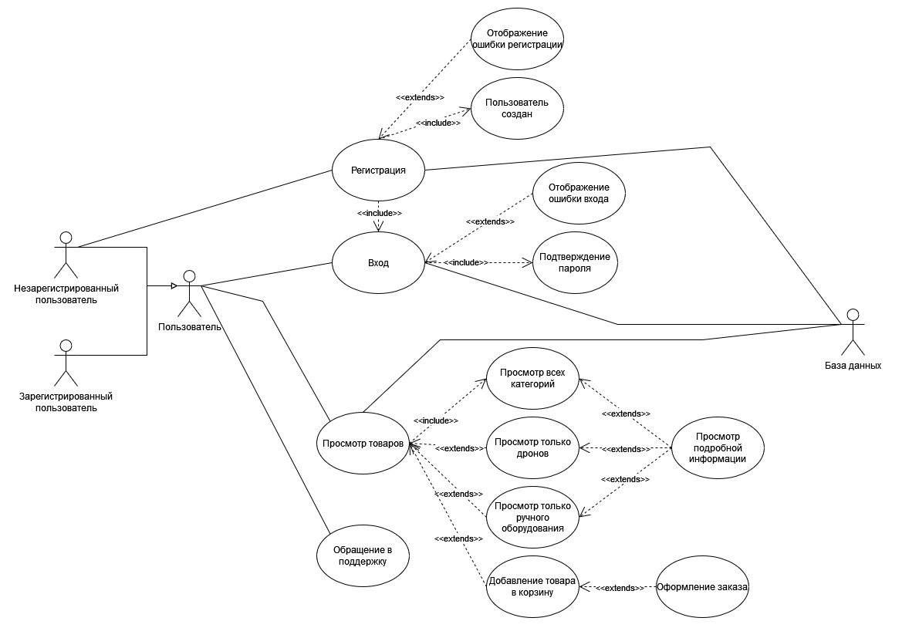

# Поток событий

---

# Содержание
1 [Актёры](#actors)  
2 [Варианты использования](#use_case)  
2.1 [Регистрация](#register)  
2.2 [Вход](#sign_in)  
2.3 [Просмотр всех категорий](#show_all_cats)  
2.4 [Просмотр только дронов](#show_drones)  
2.5 [Просмотр только ручного оборудования](#show_handheld)  
2.6 [Добавление товара в корзину](#add_to_cart)  
2.7 [Оформление заказа](#order)  
2.8 [Обращение в поддержку](#support)  

<a name="actors"/>

# 1 Актёры

| Актёр                           | Описание                                                                |
|:--------------------------------|:------------------------------------------------------------------------|
| Анонимный пользователь          | Пользователь, который не хочет регистрироваться в приложении            |
| Зарегистрированный пользователь | Пользователь, который вошел в приложение под своим именем (псевдонимом) |
| База данных                     | База данных, хранящая информацию о товарах и пользователях              |

<a name="use_case"/>

# 2 Варианты использования

Use Case диаграммы приложения "Dash":

<a name="register"/>

## 2.1 Регистрация
**Описание.** Вариант использования "Регистрация" позволяет пользователю
зарегистрироваться в приложении.  

1. Вариант использования начинается, когда пользователь нажал на кнопку "Sign Up".
2. Приложение предлагает ввести свое имя или псевдоним, пароль и подтверждение пароля. 
3. Пользователь вводит имя или псевдоним, пароль и подтверждение пароля.
4. Приложение выполняет запрос в базу данных на проверку существования пользователя с таким
именем.
5. Если пользователь с таким именем уже существует, приложение выводит сообщение 
об ошибке и переходит к пункту 2.
6. Если пароль недостаточно надежный, приложение выводит сообщение о том, что пароль
недостаточно надежный и переходит к пункту 2.
7. Конец варианта использования. 

<a name="sign_in"/>

## 2.2 Вход

**Описание.** Вариант использования "Вход" позволяет пользователю войти в приложение.  
**Предусловия.** Пользователь уже прошел вариант использования "Регистрация".

1. Приложение предлагает ввести свое имя или псевдоним и пароль. 
2. Пользователь вводит имя или псевдоним и пароль.
3. Приложение выполняет запрос в базу данных на проверку существования пользователя с таким
именем.
4. Если пользователя с таким именем не существует или пароль неверный, приложение
выводит сообщение об ошибке и переходит к пункту 1.
5. Конец варианта использования. 

<a name="show_all_cats"/>

## 2.3 Просмотр всех категорий

**Описание.** Вариант использования "Просмотр всех категорий" позволяет пользователю
просмотреть информацию о всех товарах из любой категории.
  
1. Пользователь просматривает краткую информацию о всех товарах на сайте.
2. По нажатии на кнопку "Learn more" пользователь может просмотреть подробную информацию о
товаре.
3. По нажатии на кнопку "Bye Now" выбранный пользователем товар попадает в корзину и
выполняет вариант "Добавление товара в корзину".
4. Конец варианта использования.

<a name="show_drones"/>

## 2.4 Просмотр только дронов
 **Описание.** Вариант использования "Просмотр только дронов" позволяет пользователю 
 просмотреть информацию только о квадрокоптерах.

1. Пользователь просматривает краткую информацию только о квадрокоптерах.
2. По нажатии на кнопку "Learn more" пользователь может просмотреть подробную информацию о
товаре.
3. По нажатии на кнопку "Bye Now" выбранный пользователем товар попадает в корзину и
выполняет вариант "Добавление товара в корзину".
4. Конец варианта использования. 

<a name="show_handheld"/>

## 2.5 Просмотр только ручного оборудования

**Описание.** Вариант использования "Просмотр только ручного оборудования" позволяет
пользователю просмотреть информацию только о ручном оборудовании.  

1. Пользователь просматривает краткую информацию только о ручном оборудовании.
2. По нажатии на кнопку "Learn more" пользователь может просмотреть подробную информацию о
товаре.
3. По нажатии на кнопку "Bye Now" выбранный пользователем товар попадает в корзину и
выполняет вариант "Добавление товара в корзину".
4. Конец варианта использования.

<a name="add_to_cart"/>

## 2.6 Добавление товара в корзину

**Описание.** Вариант использования "Добавление товара в корзину" позволяет пользователю
добавить выбранный товар в корзину.  
1. Пользователь может просмотреть информацию о всех товарах в корзине, их количестве и
итоговой цене за заказ.
2. Пользователь может удалить товар из корзины, нажав на кнопку "Delete".
3. Пользователь может изменить количество выбранного товара, указав нужное количество, 
используя соответствующую кнопку, и нажав на клавишу "Refresh".
4. Пользователь может нажать на клавишу "Back to Store". В таком случае выполняется 
вариант использования "Просмотр всех категорий".
5. Пользователь может оформить заказ, нажав на клавишу "Order Now". В таком случае
выполняется вариант использования "Оформление заказа".
6. Конец варианта использования.

<a name="order"/>

## 2.7 Оформление заказа

**Описание.** Вариант использования "Оформление заказа" позволяет пользователю
оформить заказ.  
**Предусловия.** Пользователь уже прошел вариант использования "Добавление товара в корзину" 
1. Пользователь вводит свое имя.
2. Пользователь вводит свой номер телефона, для того, чтобы с ним мог связаться оператор.
3. Пользователь вводит адрес доставки.
4. Конец варианта использования.

<a name="support"/>

## 2.8 Обращение в поддержку

**Описание.** Вариант использования "Обращение в поддержку" позволяет пользователю
отправить сообщение о неполадках  

1. Пользователь вводит свой email.
2. Пользователь выбирает тип проблемы.
3. Пользователь описывает свою проблемы в разделе "Description of needs".
4. Конец варианта использования.